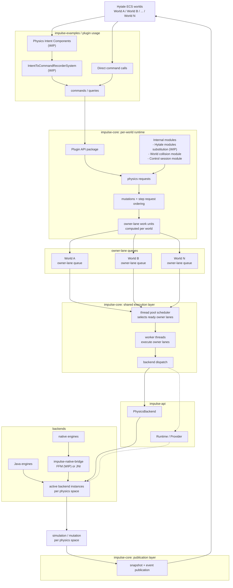
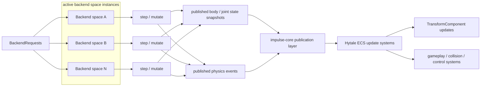

# Impulse

Impulse is a physics framework for Hytale that connects Hytale ECS worlds to pluggable physics engines.

## Modules

Impulse codebase is divided as follows:

- **impulse-core** - Hytale ECS integration and backend communication.
- **impulse-api** - backend-agnostic API layer and contracts.
- **impulse-native-loader** - legacy loader for PhysicsBackend
- **impulse-examples** - example plugins to understand the framework usage.
  
Official physics backend implementations:
- **impulse-bullet** - Libbulletjme backend implementation.
- **impulse-rapier** - Rapier backend with a small Rust/JNI native shim.

### Architecture

<details>
<summary>High level architecture diagram</summary>



</details>

<details>
<summary>Snapshot and Events publication</summary>



</details>

For detailed explainations read each module's README.md and code documentation

## Getting started

You can start a debug server with all the example mods and backend jars by running:

```bash
./gradlew runAllMods
```

### Backend Provider Jars

Backend jars are Java service-provider jars. Impulse discovers `PhysicsBackend` providers from jars anywhere under the configured Hytale `mods` directories.

When multiple backend jars are installed, create spaces with an explicit backend:

```bash
/impulse space create --backend=impulse:rapier
```

The Rapier backend needs a Rust toolchain to build its native library. If `cargo` is available, `:impulse-rapier:processResources` builds and packages the current build platform native library automatically. You can also force native compilation with:

```bash
./gradlew :impulse-rapier:build -PbuildRapierNative=true
```

It also supports SIMD optimizations that can be enabled using:

```bash
./gradlew -PrapierNativeFeatures=rapier-simd-stable runAllMods
```

## Testing

Impulse has a dedicated headless/serverless test lane that does not boot the Hytale server or example runtime:

```bash
./gradlew headlessTest
```

Crucible in-game tests are also provided. Run them in game with:

```
/crucible run
```

## Native Binary Notice

Backend provider artifacts may include third-party native binaries so Impulse can load the
backend at runtime. These artifacts are convenience packages for Impulse plugins; they are not
the official upstream distribution channel for those native libraries. Download standalone
Bullet/Libbulletjme or Rapier binaries from their upstream projects instead.

## Code style

The project uses Google Java Style with K&R braces and 4 spaces indentation. 
See [.editorconfig](.editorconfig) for the full formatting configuration.

## License

The Impulse project follows the [Apache License 2.0](LICENSE) license. Third-party licenses are under [licenses/](licenses).
